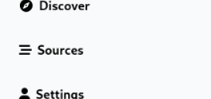

# Sources

Nindo is a central place where you can read all your favorite blogs and other sites. It also allows you to post content on Nindo itself. There is no tracking and AI to create a feed for you, you can do it yourself by following other users and adding external sites.

Following external sites works via RSS. RSS is a way to follow external sites that most major platforms support. It also allows you to follow users from other Nindo instances.

An external website you add is called a **source**. Sources can be added via the "Sources" tab.

